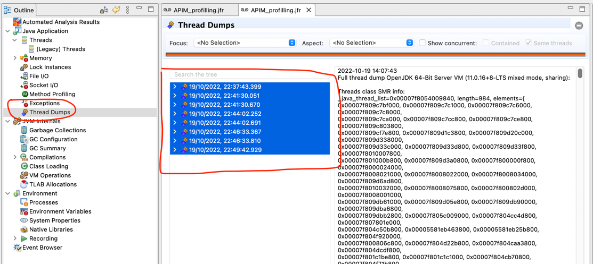

## Extracting thread dumps from the JFR dump

The JFR dump contains multiple thread dumps. We can extract them for further analysis.

### How to extract thread dumps ?

* Open the JFR file with the JDK mission control application. 
* Copy the thread dumps section by marking all the dump from the UI.

  

* Create a empty file AllThreadDumps.txt and save it.
* Split the threadumps with the below command.

  ```  
  split -p "[0-9]{4}-[0-9]{2}-[0-9]{2}" ../AllThreadDumps.txt 
  ```
  Ex: 
  
    ```  

  % ls
  % AllThreaddumps.txt
  %
  % split -p "[0-9]{4}-[0-9]{2}-[0-9]{2}" AllThreaddumps.txt
  %
  % ls -l
  -rw-r--r--  1 janakap  staff  2227321 Oct 20 15:45 AllThreaddumps.txt
  -rw-r--r--  1 janakap  staff  2227321 Oct 20 15:45 xaa
  -rw-r--r--  1 janakap  staff  2259452 Oct 20 15:45 xab
  -rw-r--r--  1 janakap  staff  2237971 Oct 20 15:45 xac
  -rw-r--r--  1 janakap  staff  2245693 Oct 20 15:45 xad
  -rw-r--r--  1 janakap  staff  2263219 Oct 20 15:45 xae
  -rw-r--r--  1 janakap  staff  2256935 Oct 20 15:45 xaf
  -rw-r--r--  1 janakap  staff  2289415 Oct 20 15:45 xag
  -rw-r--r--  1 janakap  staff  2224785 Oct 20 15:45 xah
    ```
